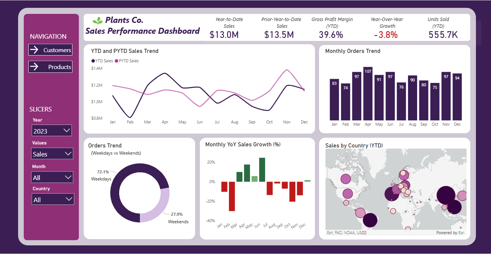
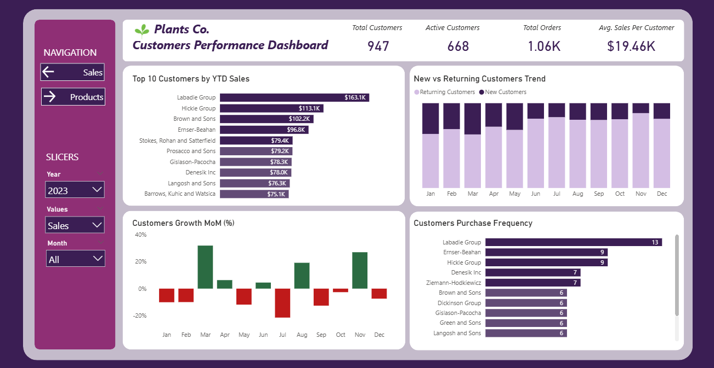
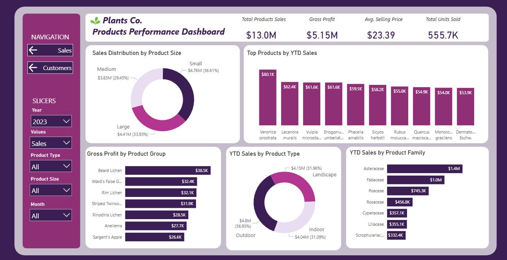

# 🌱 Plants Co. Sales Analysis (2023) – Power BI Project

> A full-year business intelligence analysis exploring sales, customer behavior, and product performance for **Plants Co.**  
> Built end-to-end using Power BI, DAX, Power Query, and a clean star-schema model.  

---

## 📘 Table of Contents

- [Project Overview](#project-overview)  
- [Objectives](#objectives)  
- [Data Description & Time Coverage](#data-description--time-coverage)  
- [Key Features](#key-features)    
- [Tools & Technologies](#tools--technologies)  
- [Insights & Dashboard Preview](#insights--dashboard-preview)  
  - [Sales Performance](#1-sales-performance-dashboard)
  - [YTD vs Prior YTD — Month-by-Month Comparison (2023 vs PYTD)](#ytd-vs-prior-ytd--month-by-month-comparison-2023-vs-pytd)   
  - [Customer Performance](#2-customer-performance-dashboard)  
  - [Product Performance](#3-product-performance-dashboard)  
- [Detailed & Actionable Recommendations](#detailed--actionable-recommendations)  
- [Conclusion](#conclusion)  

---

## 🔍 Project Overview

This repository contains a complete Power BI analysis of **Plants Co.** for the year **2023**, built to answer operational and strategic questions about sales, customers, and products.  
The goal is to convert transactional data into a concise business story and deliver prioritized recommendations you can act on.

---

## 🎯 Objectives

- Provide a clear month-to-month and year-over-year view of sales performance.  
- Understand customer loyalty, acquisition, and frequency patterns.  
- Identify top and high-margin products and families.  
- Expose regional strengths and concentration risks.  
- Deliver concrete, prioritized recommendations for growth and margin improvement.

---

## 📊 Data Description & Time Coverage

- **Fact_Sales**: transaction-level data (Sales_USD, Quantity, Price_USD, COGS_USD, Account_id, Product_id, Date)  
- **Dim_Products**: product metadata (name, family, group, type, size)  
- **Dim_Accounts**: customer attributes (Country, Account lifecycle dates, segmentation fields)  
- **Dim_Date**: calendar table (Day, Month, Year, IsWeekend, Year-Month, Quarter)

**Time coverage:** **2022 → Q1 2024** (dashboards default to 2023 view).  
Dashboards include **year slicers (2022, 2023, 2024)** so users can compare any year in the dataset, e.g., 2022 vs 2023, or 2023 vs Q1 2024.

---

## ✨ Key Features

- Star-schema model with clean relationships and optimized measures.  
- DAX-driven KPIs: YTD Sales, YoY Growth, MoM Growth, Gross Profit, Customer Growth MoM, Purchase Frequency, and more.  
- Interactive slicers to select Year (2022–2024), Region, Product Family, and Date ranges.  
- Year comparison visuals: line charts comparing 2022, 2023 (YTD) and prior YTD to expose momentum and trends.  
- Drillthrough capability to inspect product / customer-level detail from summary views.  
- Designed for both executive summaries and operational troubleshooting.

---

## 🛠 Tools & Technologies

- **Power BI Desktop** (visualization & modeling)  
- **Power Query** (ETL and cleaning)  
- **DAX** (measures and time intelligence)  
- **Excel / CSV** (source files)  
- **Git / GitHub** (documentation & versioning)

---

# 📈 Insights & Dashboard Preview

## **1. Sales Performance Dashboard**

- **Sales Dashboard (overview + YTD vs PYTD comparison):** 

- **High-level performance:** 2023 closed with **$13.0M in total sales**, **555.7K units sold**, and a **39.6% gross profit margin**, profitability remained firm even as revenue movement fluctuated month-to-month.  
- **Early-year weakness, mid-year recovery, late-year softness:** January & February underperformed versus prior year, followed by a robust March → June recovery (notably April and June). The second half (July → November) drifted lower, with December slightly positive but insufficient to fully offset earlier declines.  
- **Weekday-dominant behavior:** **72.1% of orders** occur on weekdays (765 orders) producing **$9.4M** in revenue vs **$3.6M** on weekends, a clear indication of structured, business-oriented purchasing cycles (B2B or project-driven B2C).  
- **Geographic concentration & opportunities:** **China accounted for $4.01M**, substantially ahead of other markets. This concentration poses risk but also validates focused investments in that market. Several countries produced <$15K, representing low-hanging fruit for expansion.  
- **Year-comparison insights (2022 vs 2023 line chart):** the dashboards include a line-chart that plots monthly YTD sales for 2022 and 2023 side-by-side, allowing immediate visual identification of where Plants Co. gained (Mar–Jun 2023) or lost ground (Jan–Feb and Jul–Nov). The slicer allows comparing any available year (2022, 2023, 2024 Q1).

### YTD vs Prior YTD — Month-by-Month Comparison (2023 vs PYTD)

- **January:** 2023 YTD = **$1.07M** vs PYTD = **$1.19M** → **Down $0.12M** (weaker start).  
- **February:** 2023 YTD = **$807K** vs PYTD = **$1.15M** → **Down $343K** (significant early drop).  
- **March:** 2023 YTD = **$1.19M** vs PYTD = **$1.08M** → **Up $110K** (recovery begins).  
- **April:** 2023 YTD = **$1.34M** vs PYTD = **$1.14M** → **Up $200K** (strong momentum).  
- **May:** 2023 YTD = **$1.17M** vs PYTD = **$1.10M** → **Up $70K** (stable).  
- **June:** 2023 YTD = **$1.17M** vs PYTD = **$940K** → **Up $230K** (one of the strongest months).  
- **July:** 2023 YTD = **$980K** vs PYTD = **$1.13M** → **Down $150K** (mid-year slowdown).  
- **August:** 2023 YTD = **$1.09M** vs PYTD = **$1.10M** → **Down $10K** (flat).  
- **September:** 2023 YTD = **$942K** vs PYTD = **$1.01M** → **Down $68K** (below prior).  
- **October:** 2023 YTD = **$898K** vs PYTD = **$1.12M** → **Down $222K** (notable dip).  
- **November:** 2023 YTD = **$1.19M** vs PYTD = **$1.38M** → **Down $190K** (late-year weakness).  
- **December:** 2023 YTD = **$1.15M** vs PYTD = **$1.13M** → **Up $20K** (slight recovery).

**Interpretation:** 2023 shows a mid-year advantage (Mar–Jun) but consistent underperformance in early months and most of Q3–Q4 versus prior year. The month-by-month dollar differences point to specific periods (Feb, Oct, Nov) requiring immediate attention (promotions, inventory, or channel fixes).

---

## **2. Customer Performance Dashboard**

- **Customer Dashboard (top accounts, new vs returning, frequency):** 
  
- **Customer base snapshot:** **947 total customers** in the dataset, **668 active** in 2023 and **279 inactive** — the inactive cohort is a clear priority for reactivation.  
- **High average spend among actives:** active customers averaged **$19.46K each**, indicating that customers who do transact purchase at meaningful volumes.  
- **Top-account concentration:** revenue is concentrated in a small group, **Labadie Group ($163.1K)** leads, with Hickle Group and Brown & Sons also in the top tier. This provides predictable revenue but increases exposure if a top account weakens.  
- **Acquisition vs retention dynamics:** returning customers outnumber new customers every month (ex: Nov = 83 returning vs 11 new), which demonstrates excellent retention but underlines slow acquisition velocity.  
- **Volatile customer growth:** months like **March (+31.9%)** and **November (+27%)** show acquisition or reactivation success, while **January (–10.1%)**, **February (–10%)**, **May (–11.9%)**, and **July (–21.5%)** reveal dips that require steadier marketing and onboarding cadence.  
- **Frequency & loyalty:** a small cohort drives frequent purchases (Labadie Group: 13 purchases). Many mid-tier customers transact 6–9 times per year — this is the segment to nudge toward higher frequency via programs and automation.

---

## **3. Product Performance Dashboard**

- **Product Dashboard (top SKUs, profitability, family analysis):** 

- **Revenue & margin balance:** product sales generated **$13.0M** and **$5.15M gross profit**, with **555.7K units sold** and **ASP ≈ $23.39**, a healthy balance of volume and price.  
- **Top SKUs and balanced mid-tier:** **Veronica prostrata ($80.1K)** tops the list. Several others (e.g., Lecanora muralis, Vulpia microstachys, Eriogonum umbellatum) each contributed >$61K. The mid-band ($47K–$59K) provides portfolio resilience.  
- **Size & type diversification:** small, medium, and large sizes contributed **36.61% / 29.45% / 33.93%** respectively. This balanced split reduces risk from any one format. Indoor/Outdoor/Landscape split is also near-even, proving cross-segment reach.  
- **Profit hotspots:** lichen groups (Beard Lichen, Ward’s False G., Rim Lichen) delivered the highest gross profit per group and should be treated as high-priority margin drivers.  
- **Family-level trends:** **Asteraceae ($1.4M)** leads, followed by Fabaceae and Poaceae. These families are anchor categories for assortment planning.

---

# 💡 Detailed & Actionable Recommendations 

### **1) Build a Year-Round Acquisition Engine**
- Replace one-off campaigns with a steady monthly marketing plan.  
- Increase advertising during the weaker sales months (Feb, Jul, Oct).  
- Use audiences similar to your top customers to attract high-quality new buyers.

### **2) Reactivation Program for 279 Dormant Customers**
- Group inactive customers by how long ago and how much they last purchased.  
- Use a simple 3-step approach:  
  1) Personal “we miss you” message  
  2) Recommend products they previously liked  
  3) Give a short-term promo to encourage a comeback  
- Measure which offers bring the most customers back.

### **3) Regional Diversification & Channel Partnerships**
- Reduce dependence on China by growing other promising regions like Brazil, Philippines, and Portugal.  
- Test small campaigns in these regions to see what works.  
- Partner with resellers or distributors to quickly reach new markets.

### **4) Monetize High-Margin Lichen Groups**
- Promote lichen products more because they generate high profit.  
- Create special bundles or premium collections centered on lichens.  
- Offer small exclusive batches to loyal customers to build excitement.

### **5) Weekend Conversion Playbook**
- Create weekend-specific bundles, especially indoor and small-sized plants.  
- Promote weekend deals on Fridays via social media and email.  
- Test different promotional styles (flash discounts vs coupons) to see what drives more weekend sales.

### **6) Stock Keeping Units & Assortment Optimization**
- Expand fast-selling small plant products and introduce seasonal or themed sets.  
- Reduce or remove very slow-moving products to keep inventory clean.  
- Use a simple ABC analysis monthly to know which products to restock more often.

### **7) Loyalty & Frequency Programs**
- Build a loyalty program with levels or milestones to reward frequent buyers.  
- Offer perks like early access, free samples, or shipping discounts to top customers.  
- Automate follow-up emails that encourage customers to reorder or refer friends.

### **8) Forecast-Led Inventory Planning**
- Use the March to June peak window to guide inventory planning for the year.  
- Keep extra stock of popular plant families ahead of peak months.  
- Reduce holding costs by avoiding overstock of slower products and negotiating more flexible terms with suppliers.

---

# 🏁 Conclusion

This analysis gives Plants Co. both the narrative and the numbers to take immediate action: stabilize acquisition, reactivate dormant customers, diversify markets beyond China, and double down on high-margin product families. The dashboards are interactive tools meant for weekly operations reviews and quarterly strategy planning.
